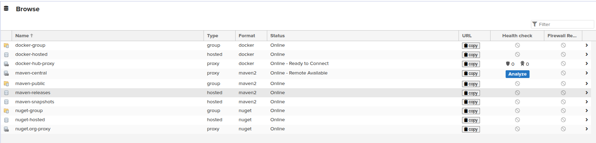
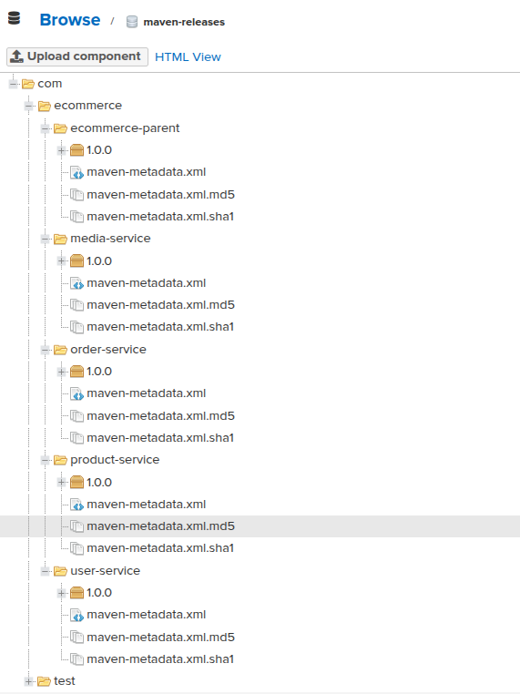
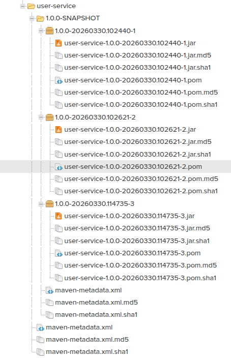
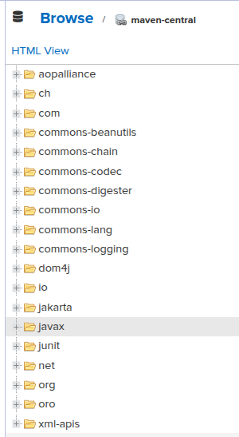

# Système de gestion d'artefacts avec Nexus

> Documentation technique — Projet e-commerce Spring Boot / Sonatype Nexus Repository Manager
> Rédigée sur la base du code source réel du projet.

---

## Table des matières

1. [Prérequis](#prérequis)
2. [Installation et configuration de Nexus](#1-installation-et-configuration-de-nexus)
3. [Configuration des repositories](#2-configuration-des-repositories)
4. [Configuration Maven](#3-configuration-maven)
5. [Gestion des dépendances via Nexus](#4-gestion-des-dépendances-via-nexus)
6. [Versioning SNAPSHOT vs RELEASE](#5-versioning-snapshot-vs-release)
7. [Intégration Docker](#6-intégration-docker)
8. [Pipeline CI/CD Jenkins](#7-pipeline-cicd-jenkins)
9. [Sécurité et contrôle d'accès (Bonus)](#8-sécurité-et-contrôle-daccès-bonus)
10. [Dépannage](#dépannage)

---

## Prérequis

| Outil | Version minimale | Rôle |
|---|---|---|
| Java (JDK) | 17 | Compilation des microservices Spring Boot |
| Maven | 3.9.x | Build et publication des artefacts |
| Docker | 24.x | Exécution de Nexus et build des images |
| Docker Compose | 2.x | Orchestration des services |

**Accès réseau :**
- Nexus UI + repositories Maven : `http://localhost:8091`
- Docker hosted registry : `localhost:5000`
- Docker proxy registry : `localhost:5001`
- Docker group registry : `localhost:5002`

> ⚠️ Le port `8081` est réservé au microservice `user-service` — Nexus est donc mappé sur `8091`.

**Variable d'environnement requise pour les builds locaux :**

```bash
export NEXUS_PASSWORD="<mot-de-passe-admin-nexus>"
```

---

## 1. Installation et configuration de Nexus

### 1.1 Démarrage via Docker Compose

Nexus est déployé via le fichier `docker-compose.nexus.yml` à la racine du projet.
L'image officielle `sonatype/nexus3` fait tourner Nexus avec l'utilisateur interne `nexus` (uid=200), jamais `root`.

```bash
# Créer le réseau si inexistant
docker network create safe-zone_ecommerce-network

# Démarrer Nexus
docker compose -f docker-compose.nexus.yml up -d

# Suivre les logs (démarrage ~2 min)
docker compose -f docker-compose.nexus.yml logs -f nexus
```

Extrait de `docker-compose.nexus.yml` :

```yaml
services:
  nexus:
    image: sonatype/nexus3:latest
    container_name: ecommerce-nexus
    restart: unless-stopped
    ports:
      - "8091:8081"   # UI Nexus + Maven repos
      - "5000:5000"   # Docker hosted registry
      - "5001:5001"   # Docker proxy registry
      - "5002:5002"   # Docker group registry
    environment:
      INSTALL4J_ADD_VM_PARAMS: >-
        -Xms512m
        -Xmx2g
        -XX:MaxDirectMemorySize=2g
        -Djava.util.prefs.userRoot=/nexus-data/javaprefs
    volumes:
      - nexus_data:/nexus-data
    healthcheck:
      test: ["CMD-SHELL", "curl -sf http://localhost:8081/service/rest/v1/status || exit 1"]
      interval: 30s
      timeout: 10s
      retries: 10
      start_period: 120s
```

### 1.2 Récupération du mot de passe admin initial

```bash
docker exec ecommerce-nexus cat /nexus-data/admin.password
```

### 1.3 Finalisation dans l'interface web

1. Ouvrir `http://localhost:8091`
2. Se connecter avec `admin` et le mot de passe récupéré ci-dessus
3. Suivre l'assistant de setup (changer le mot de passe, désactiver l'accès anonyme)


*Capture : tableau de bord Nexus avec les repositories listés dans la barre gauche*

### 1.4 Vérification de l'utilisateur non-root

```bash
docker exec ecommerce-nexus id
# → uid=200(nexus) gid=200(nexus) groups=200(nexus)
```

### 1.5 Vérification de l'état via l'API

```bash
curl -s http://localhost:8091/service/rest/v1/status | python3 -m json.tool
# → { "edition": "OSS", "state": "STARTED" }
```

---

## 2. Configuration des repositories

Le projet utilise **7 repositories** Nexus : 4 Maven et 3 Docker.

### 2.1 Repositories Maven

| Nom | Type | Politique d'écriture | Rôle |
|---|---|---|---|
| `maven-releases` | hosted | `allow_once` | Artefacts stables, non écrasables |
| `maven-snapshots` | hosted | `allow` | Builds de développement (timestampés) |
| `maven-central` | proxy | — | Cache de Maven Central |
| `maven-public` | group | — | Point d'entrée unique (miroir) |

> ℹ️ Les repositories Maven (`maven-releases`, `maven-snapshots`, `maven-central`, `maven-public`) sont présents par défaut dans Nexus 3. Ils ont été conservés tels quels.


*Capture : onglet "Repositories" montrant les 4 repositories Maven avec leur type et statut*

### 2.2 Repositories Docker

| Nom | Type | Port HTTP | Rôle |
|---|---|---|---|
| `docker-hosted` | hosted | `5000` | Stockage des images produites |
| `docker-hub-proxy` | proxy | `5001` | Cache de Docker Hub |
| `docker-group` | group | `5002` | Point d'entrée unique pour les pulls |

Les repositories Docker sont créés via l'API REST Nexus :

```bash
export NEXUS_URL="http://localhost:8091"
export NEXUS_PASS="<mot-de-passe-admin>"

# docker-hosted (port 5000)
curl -u "admin:$NEXUS_PASS" -X POST \
  "$NEXUS_URL/service/rest/v1/repositories/docker/hosted" \
  -H "Content-Type: application/json" -d '{
    "name": "docker-hosted",
    "online": true,
    "storage": {"blobStoreName": "default", "writePolicy": "allow"},
    "docker": {"v1Enabled": false, "forceBasicAuth": true, "httpPort": 5000}
  }'
```


*Capture : les 3 repositories Docker avec leurs ports respectifs*

### 2.3 Vérification via l'API

```bash
curl -s -u "admin:$NEXUS_PASS" \
  http://localhost:8091/service/rest/v1/repositories \
  | python3 -c "import sys,json; [print(r['name'], r['type']) for r in json.load(sys.stdin)]"
# → maven-central      proxy
# → maven-public       group
# → maven-releases     hosted
# → maven-snapshots    hosted
# → docker-hosted      hosted
# → docker-hub-proxy   proxy
# → docker-group       group
```

---

## 3. Configuration Maven

### 3.1 Structure du projet Maven

Le projet utilise un **POM parent** (`backend/pom.xml`) dont héritent les 4 microservices :

```
backend/
├── pom.xml                  ← POM parent (ecommerce-parent)
├── user-service/pom.xml     ← hérite du parent
├── product-service/pom.xml
├── media-service/pom.xml
└── order-service/pom.xml
```

Le POM parent centralise la configuration Nexus dans `<distributionManagement>` :

```xml
<distributionManagement>
    <repository>
        <id>nexus-releases</id>
        <url>http://localhost:8091/repository/maven-releases/</url>
    </repository>
    <snapshotRepository>
        <id>nexus-snapshots</id>
        <url>http://localhost:8091/repository/maven-snapshots/</url>
    </snapshotRepository>
</distributionManagement>
```

Chaque service déclare son parent ainsi (exemple : `user-service/pom.xml`) :

```xml
<parent>
    <groupId>com.ecommerce</groupId>
    <artifactId>ecommerce-parent</artifactId>
    <version>1.1.0-SNAPSHOT</version>
    <relativePath>../pom.xml</relativePath>
</parent>
```

### 3.2 settings.xml — credentials et miroir

Le fichier `settings.xml` à la racine du projet configure :
- Les credentials d'accès aux 3 serveurs Nexus (via la variable d'environnement `NEXUS_PASSWORD`)
- Le miroir global qui redirige **tous** les téléchargements Maven vers Nexus

```xml
<settings xmlns="http://maven.apache.org/SETTINGS/1.0.0">

  <servers>
    <server>
      <id>nexus-mirror</id>
      <username>admin</username>
      <password>${env.NEXUS_PASSWORD}</password>
    </server>
    <server>
      <id>nexus-releases</id>
      <username>admin</username>
      <password>${env.NEXUS_PASSWORD}</password>
    </server>
    <server>
      <id>nexus-snapshots</id>
      <username>admin</username>
      <password>${env.NEXUS_PASSWORD}</password>
    </server>
  </servers>

  <mirrors>
    <mirror>
      <id>nexus-mirror</id>
      <mirrorOf>*</mirrorOf>
      <url>http://localhost:8091/repository/maven-public/</url>
    </mirror>
  </mirrors>

  <profiles>
    <profile>
      <id>nexus</id>
      <repositories>
        <repository>
          <id>nexus-public</id>
          <url>http://localhost:8091/repository/maven-public/</url>
          <releases><enabled>true</enabled></releases>
          <snapshots><enabled>true</enabled></snapshots>
        </repository>
      </repositories>
    </profile>
  </profiles>

  <activeProfiles>
    <activeProfile>nexus</activeProfile>
  </activeProfiles>

</settings>
```

### 3.3 Usage en local

```bash
# Copier le settings.xml pour Maven local
cp settings.xml ~/.m2/settings.xml

# Définir le mot de passe (à ajouter dans ~/.bashrc ou ~/.zshrc)
export NEXUS_PASSWORD="<mot-de-passe-admin>"
```

### 3.4 Publication des artefacts

```bash
cd backend
mvn -B deploy -DskipTests -s ../settings.xml
```

Sortie console attendue (extrait) :

```
[INFO] Uploading to nexus-snapshots: http://localhost:8091/repository/maven-snapshots/
         com/ecommerce/user-service/1.1.0-SNAPSHOT/user-service-1.1.0-20260330.114735-3.jar
[INFO] Uploaded to nexus-snapshots: ... (49 MB at 142 MB/s)
[INFO] BUILD SUCCESS
```


*Capture : Browse > maven-snapshots > com/ecommerce/user-service montrant les JARs timestampés*

---

## 4. Gestion des dépendances via Nexus

### 4.1 Principe du proxy Maven Central

Le miroir `<mirrorOf>*</mirrorOf>` dans `settings.xml` redirige **toutes** les requêtes Maven vers `maven-public` (le groupe Nexus). Ce groupe agrège :

```
maven-public (group)
├── maven-releases    (artefacts internes stables)
├── maven-snapshots   (artefacts internes de dev)
└── maven-central     (proxy vers https://repo1.maven.org/maven2/)
```

Au premier téléchargement, Nexus récupère la dépendance depuis Maven Central et la met en cache. Les builds suivants utilisent le cache local Nexus — **sans accès internet**.

### 4.2 Vérification que les dépendances transitent par Nexus

Dans les logs Maven (avec `-s ../settings.xml`), chaque téléchargement affiche l'URL Nexus :

```
[INFO] Downloading from nexus-mirror:
       http://localhost:8091/repository/maven-public/
       org/springframework/boot/spring-boot-starter-web/3.2.0/spring-boot-starter-web-3.2.0.pom
[INFO] Downloaded from nexus-mirror: ... (2.9 kB at 225 kB/s)
```


*Capture : Browse > maven-central montrant les artefacts Spring Boot mis en cache*

### 4.3 Vérification via l'API

```bash
# Lister les artefacts Spring Boot mis en cache
curl -s -u "admin:$NEXUS_PASSWORD" \
  "http://localhost:8091/service/rest/v1/search?repository=maven-central&group=org.springframework.boot" \
  | python3 -c "import sys,json; print(len(json.load(sys.stdin)['items']), 'artefacts en cache')"
```

---

## 5. Versioning SNAPSHOT vs RELEASE

### 5.1 Différence SNAPSHOT / RELEASE

| | SNAPSHOT | RELEASE |
|---|---|---|
| Suffixe version | `1.1.0-SNAPSHOT` | `1.0.0` |
| Repository cible | `maven-snapshots` | `maven-releases` |
| Réécriture | Autorisée (plusieurs builds) | Interdite (`allow_once`) |
| Nommage fichier | `user-service-1.0.0-20260330.114735-3.jar` | `user-service-1.0.0.jar` |
| Usage | Développement quotidien | Livraison stable |

Maven route automatiquement : si la version contient `-SNAPSHOT`, le deploy va dans `maven-snapshots` ; sinon dans `maven-releases`.

### 5.2 Workflow quotidien (SNAPSHOT)

```bash
cd backend
export NEXUS_PASSWORD="<mot-de-passe>"
mvn -B deploy -DskipTests -s ../settings.xml
# → Publie dans maven-snapshots avec timestamp :
#    user-service-1.1.0-20260330.HHMMSS-N.jar
```

### 5.3 Script de release : `scripts/release.sh`

Ce script automatise le cycle complet SNAPSHOT → RELEASE → SNAPSHOT suivant :

```bash
# Usage
export NEXUS_PASSWORD="<mot-de-passe>"
./scripts/release.sh <version-release> <prochaine-version-snapshot>

# Exemple : publier la version 1.0.0, puis continuer en 1.1.0-SNAPSHOT
./scripts/release.sh 1.0.0 1.1.0-SNAPSHOT
```

**Ce que fait le script :**

```bash
#!/bin/bash
set -e

# 1. Passe tous les pom.xml de SNAPSHOT à RELEASE (ex: 1.0.0)
mvn -s ../settings.xml versions:set -DnewVersion="$RELEASE_VERSION" -DgenerateBackupPoms=false

# 2. Build + deploy vers nexus-releases
mvn -s ../settings.xml clean deploy -DskipTests

# 3. Commit + tag git
git add backend/*/pom.xml backend/pom.xml
git commit -m "release: $RELEASE_VERSION"
git tag -a "v$RELEASE_VERSION" -m "Release $RELEASE_VERSION"

# 4. Passe à la prochaine version SNAPSHOT (ex: 1.1.0-SNAPSHOT)
mvn -s ../settings.xml versions:set -DnewVersion="$NEXT_SNAPSHOT_VERSION" -DgenerateBackupPoms=false
git add backend/*/pom.xml backend/pom.xml
git commit -m "chore: bump to $NEXT_SNAPSHOT_VERSION"
```

### 5.4 Vérification des deux repositories

```bash
export NEXUS_PASSWORD="<mot-de-passe>"

# SNAPSHOTs (plusieurs builds timestampés)
curl -s -u "admin:$NEXUS_PASSWORD" \
  "http://localhost:8091/service/rest/v1/search?repository=maven-snapshots&group=com.ecommerce" \
  | python3 -c "import sys,json; [print(v['name'], v['version']) for v in json.load(sys.stdin)['items']]"

# RELEASEs (versions stables)
curl -s -u "admin:$NEXUS_PASSWORD" \
  "http://localhost:8091/service/rest/v1/search?repository=maven-releases&group=com.ecommerce" \
  | python3 -c "import sys,json; [print(v['name'], v['version']) for v in json.load(sys.stdin)['items']]"
```


*Capture : Browse côte à côte — maven-snapshots (builds timestampés) et maven-releases (version stable)*

### 5.5 Récupérer une version spécifique

Dans un `pom.xml` dépendant :

```xml
<!-- Dernière SNAPSHOT (résolution dynamique) -->
<dependency>
    <groupId>com.ecommerce</groupId>
    <artifactId>user-service</artifactId>
    <version>1.1.0-SNAPSHOT</version>
</dependency>

<!-- Release figée -->
<dependency>
    <groupId>com.ecommerce</groupId>
    <artifactId>user-service</artifactId>
    <version>1.0.0</version>
</dependency>
```

---

## 6. Intégration Docker

### 6.1 Architecture du build Docker multi-stage

Les Dockerfiles utilisent un build **multi-stage** : Maven compile dans le premier stage, seul le JRE + JAR est conservé dans le stage final.

**Problème résolu — injection du mot de passe dans le build Docker :**

Maven à l'intérieur du container doit s'authentifier auprès de Nexus. La variable `${env.NEXUS_PASSWORD}` dans `settings.xml` ne peut pas être résolue directement si le mot de passe contient des caractères spéciaux (ex : `$`). La solution est d'injecter le mot de passe littéral via AWK avant que Maven ne lise le fichier :

```dockerfile
FROM maven:3.9.6-eclipse-temurin-17 AS build
ARG NEXUS_PASSWORD
ENV NEXUS_PASSWORD=${NEXUS_PASSWORD}
WORKDIR /workspace

# Injection du mot de passe littéral dans settings.xml
COPY settings.xml /tmp/settings-template.xml
RUN mkdir -p /root/.m2 && \
    awk '{gsub(/\$\{env\.NEXUS_PASSWORD\}/, ENVIRON["NEXUS_PASSWORD"]); print}' \
    /tmp/settings-template.xml > /root/.m2/settings.xml

# Copie du POM parent et du service
COPY backend/pom.xml /pom.xml
COPY backend/user-service/pom.xml .
COPY backend/user-service/src ./src
RUN mvn -B clean package -DskipTests

FROM eclipse-temurin:17-jre
WORKDIR /app
RUN addgroup --system spring && adduser --system --ingroup spring spring
USER spring
COPY --from=build /workspace/target/user-service-*.jar app.jar
EXPOSE 8081
ENTRYPOINT ["java","-jar","/app/app.jar"]
```

**Points clés :**
- Le contexte de build est la **racine du projet** (pas `backend/user-service/`) pour pouvoir copier `settings.xml` et `backend/pom.xml`
- `--network=host` dans `docker-compose.yml` permet au build Maven d'atteindre `localhost:8091`
- Le wildcard `*.jar` dans le `COPY final` évite de hardcoder la version

### 6.2 Build via Docker Compose

```bash
# Passer NEXUS_PASSWORD depuis le fichier .env
docker compose build --no-cache

# Ou pour un seul service
docker compose build user-service
```

Le `docker-compose.yml` passe le mot de passe en argument de build :

```yaml
user-service:
  build:
    context: .
    dockerfile: backend/user-service/Dockerfile
    network: host
    args:
      NEXUS_PASSWORD: ${NEXUS_PASSWORD:-}
```

### 6.3 Push des images vers Nexus

Le script `scripts/docker-push-nexus.sh` build et pousse les 4 services :

```bash
export NEXUS_PASSWORD="<mot-de-passe>"
./scripts/docker-push-nexus.sh 1.1.0-SNAPSHOT
```

Opérations effectuées pour chaque service :

```bash
# Login
echo "$NEXUS_PASSWORD" | docker login localhost:5000 -u admin --password-stdin

# Build avec tag Nexus
docker build \
  --network=host \
  --build-arg NEXUS_PASSWORD="$NEXUS_PASSWORD" \
  -f backend/user-service/Dockerfile \
  -t localhost:5000/ecommerce/user-service:1.1.0-SNAPSHOT \
  -t localhost:5000/ecommerce/user-service:latest \
  .

# Push
docker push localhost:5000/ecommerce/user-service:1.1.0-SNAPSHOT
docker push localhost:5000/ecommerce/user-service:latest
```

### 6.4 Pull d'une image depuis Nexus

```bash
docker pull localhost:5000/ecommerce/user-service:1.1.0-SNAPSHOT
# → Status: Downloaded newer image for localhost:5000/ecommerce/user-service:1.1.0-SNAPSHOT
```

### 6.5 Vérification dans Nexus

```bash
curl -s -u "admin:$NEXUS_PASSWORD" \
  "http://localhost:8091/service/rest/v1/search?repository=docker-hosted" \
  | python3 -c "import sys,json; [print(v['name'], v['version']) for v in json.load(sys.stdin)['items']]"
# → ecommerce/user-service     1.1.0-SNAPSHOT
# → ecommerce/user-service     latest
# → ecommerce/product-service  1.1.0-SNAPSHOT
# → ...
```


*Capture : Browse > docker-hosted montrant les 4 images avec leurs tags*

---

## 7. Pipeline CI/CD Jenkins

### 7.1 Prérequis Jenkins

Créer le credential dans Jenkins **avant** d'exécuter le pipeline :

```
Manage Jenkins → Credentials → (global) → Add Credentials
  Kind        : Secret text
  Secret      : <mot-de-passe-nexus>
  ID          : nexus-admin-password
  Description : Nexus admin password
```

### 7.2 Variables d'environnement du pipeline

```groovy
environment {
    EMAIL_RECIPIENTS = 'frederic.tischler2@gmail.com'
    DEMO_API_TOKEN   = credentials('demo-api-token')
    NEXUS_PASSWORD   = credentials('nexus-admin-password')  // injecté depuis Jenkins
    NEXUS_REGISTRY   = 'localhost:5000'
}
```

### 7.3 Stages du pipeline

```groovy
pipeline {
    agent any
    tools { jdk 'JDK17' }

    stages {

        // ── 1. Récupération du code ──────────────────────────────────────
        stage('Checkout') {
            steps { checkout scm }
        }

        // ── 2. Build backend (Maven via Nexus) ───────────────────────────
        stage('Build_Backend') {
            steps {
                dir('backend') {
                    sh 'mvn -B clean package -DskipTests -s ../settings.xml'
                    // Nexus sert les dépendances depuis son cache (maven-public)
                }
            }
        }

        // ── 3. Tests backend ─────────────────────────────────────────────
        stage('Test_Backend') {
            steps {
                dir('backend') {
                    sh 'mvn -B test -s ../settings.xml'
                }
            }
        }

        // ── 4 & 5. Frontend ──────────────────────────────────────────────
        stage('Build_Frontend') {
            steps { dir('frontend') { sh 'npm ci && npm run build -- --configuration production' } }
        }
        stage('Test_Frontend') {
            steps { dir('frontend') { sh 'npm test -- --watch=false --browsers=ChromeHeadless' } }
        }

        // ── 6. Publication Maven → Nexus ─────────────────────────────────
        stage('Publish_Maven_Artifacts') {
            steps {
                dir('backend') {
                    sh 'mvn -B deploy -DskipTests -s ../settings.xml'
                    // Route auto : -SNAPSHOT → maven-snapshots, sinon → maven-releases
                }
            }
        }

        // ── 7. Build + Push images Docker → Nexus ────────────────────────
        stage('Build_Push_Docker_Images') {
            steps {
                script {
                    // Version = version du POM + numéro de build Jenkins
                    def imageVersion = sh(
                        returnStdout: true,
                        script: 'cd backend && mvn help:evaluate -Dexpression=project.version -q -DforceStdout -s ../settings.xml'
                    ).trim() + "-${env.BUILD_NUMBER}"

                    sh "echo \"\$NEXUS_PASSWORD\" | docker login \"\$NEXUS_REGISTRY\" -u admin --password-stdin"

                    ['user-service', 'product-service', 'media-service', 'order-service'].each { svc ->
                        sh """
                            docker build --network=host \\
                                --build-arg NEXUS_PASSWORD="\$NEXUS_PASSWORD" \\
                                -f backend/${svc}/Dockerfile \\
                                -t "\$NEXUS_REGISTRY/ecommerce/${svc}:${imageVersion}" \\
                                -t "\$NEXUS_REGISTRY/ecommerce/${svc}:latest" .
                            docker push "\$NEXUS_REGISTRY/ecommerce/${svc}:${imageVersion}"
                            docker push "\$NEXUS_REGISTRY/ecommerce/${svc}:latest"
                        """
                    }
                }
            }
        }

        // ── 8. Déploiement ───────────────────────────────────────────────
        stage('Deploy') {
            steps {
                sh 'docker compose down --remove-orphans || true'
                sh 'docker compose up -d --build'
            }
            post {
                failure {
                    sh 'docker compose -f docker-compose.stable.yml up -d'
                }
            }
        }
    }

    post {
        success {
            mail to: env.EMAIL_RECIPIENTS,
                 subject: "SUCCESS: ${env.JOB_NAME} #${env.BUILD_NUMBER}",
                 body: "Build réussi.\nNexus : http://localhost:8091\nURL : ${env.BUILD_URL}"
        }
        failure {
            mail to: env.EMAIL_RECIPIENTS,
                 subject: "FAILURE: ${env.JOB_NAME} #${env.BUILD_NUMBER}",
                 body: "Échec du build. Détails : ${env.BUILD_URL}"
        }
    }
}
```

### 7.4 Schéma du flux CI/CD

```
git push
    │
    ▼
Jenkins (Checkout)
    │
    ├─ Build_Backend    → mvn package     (dépendances via Nexus)
    ├─ Test_Backend     → mvn test
    ├─ Build_Frontend   → npm build
    ├─ Test_Frontend    → npm test
    │
    ├─ Publish_Maven_Artifacts  → mvn deploy → nexus-snapshots / nexus-releases
    ├─ Build_Push_Docker_Images → docker push → localhost:5000/ecommerce/*
    │
    └─ Deploy           → docker compose up
         │
         └─ [failure]   → docker compose -f docker-compose.stable.yml up
```


*Capture : vue "Stage View" du pipeline Jenkins montrant les 8 stages dont Publish_Maven_Artifacts et Build_Push_Docker_Images*

---

## 8. Sécurité et contrôle d'accès (Bonus)

### 8.1 Rôles créés

| ID rôle | Permissions | Usage |
|---|---|---|
| `developer-role` | Lecture maven-public + R/W maven-snapshots + lecture docker-hosted | Développeurs |
| `deployer-role` | R/W maven-releases + maven-snapshots + push docker-hosted | Jenkins CI |
| `readonly-role` | Lecture seule sur tous les repositories (`*`) | Auditeurs, lecture externe |

### 8.2 Utilisateurs créés

| userId | Rôle | Usage |
|---|---|---|
| `ci-deployer` | `deployer-role` | Compte de service Jenkins |
| `dev-user` | `developer-role` | Développeurs en local |

### 8.3 Script de configuration : `scripts/setup-nexus-rbac.sh`

```bash
export NEXUS_PASSWORD="<mot-de-passe-admin>"
./scripts/setup-nexus-rbac.sh
# → OK developer-role
# → OK deployer-role
# → OK readonly-role
# → OK ci-deployer
# → OK dev-user
```

Le script utilise l'API REST Nexus pour créer rôles et utilisateurs (idempotent — ne plante pas si déjà existants).

### 8.4 Validation des permissions

```bash
# Test 1 : dev-user peut LIRE (200 attendu)
curl -s -o /dev/null -w "%{http_code}" \
  -u "dev-user:Dev@Read2024!" \
  "http://localhost:8091/repository/maven-public/"
# → 200 ✓

# Test 2 : dev-user ne peut PAS déployer en releases (403 attendu)
curl -s -o /dev/null -w "%{http_code}" \
  -u "dev-user:Dev@Read2024!" -X PUT \
  --data-binary "test" \
  "http://localhost:8091/repository/maven-releases/com/test/test/1.0/test-1.0.jar"
# → 403 ✓

# Test 3 : ci-deployer peut déployer en releases (201 attendu)
curl -s -o /dev/null -w "%{http_code}" \
  -u "ci-deployer:Ci@Deploy2024!" -X PUT \
  --data-binary "test" \
  "http://localhost:8091/repository/maven-releases/com/test/test/1.0/test-1.0.jar"
# → 201 ✓
```


*Capture : Security > Roles montrant les 3 rôles créés avec leurs privilèges*


*Capture : Security > Users montrant ci-deployer et dev-user avec leurs rôles respectifs*

---

## Dépannage

### 401 Unauthorized — Maven en local

**Symptôme :** `authentication failed ... status: 401 Unauthorized`

**Cause 1 :** `NEXUS_PASSWORD` non défini dans le shell.
```bash
# Vérification
echo "LEN=$(echo -n "$NEXUS_PASSWORD" | wc -c)"  # doit être > 0

# Solution
export NEXUS_PASSWORD="<mot-de-passe>"
```

**Cause 2 :** Utilisation de `-s settings.xml` sans que `NEXUS_PASSWORD` soit exporté.
Maven lit `${env.NEXUS_PASSWORD}` depuis le fichier settings.xml du projet — la variable d'environnement doit donc être disponible dans le shell courant.

**Cause 3 :** Le mot de passe contient des caractères spéciaux (ex : `$`) qui interfèrent avec l'interpolation Maven.
Solution : générer `~/.m2/settings.xml` avec le mot de passe en clair :
```bash
sed "s/\${env.NEXUS_PASSWORD}/$NEXUS_PASSWORD/g" settings.xml > ~/.m2/settings.xml
```

---

### 401 Unauthorized — Maven dans Docker

**Symptôme :** Le build Docker lance Maven mais obtient 401 sur Nexus.

**Cause :** `${env.NEXUS_PASSWORD}` n'est pas résolu par Maven si le mot de passe contient `$`.

**Solution implémentée :** Substitution AWK dans le Dockerfile avant l'appel Maven :
```dockerfile
COPY settings.xml /tmp/settings-template.xml
RUN mkdir -p /root/.m2 && \
    awk '{gsub(/\$\{env\.NEXUS_PASSWORD\}/, ENVIRON["NEXUS_PASSWORD"]); print}' \
    /tmp/settings-template.xml > /root/.m2/settings.xml
```

---

### Maven ne passe pas par Nexus

**Symptôme :** Les logs Maven montrent `https://repo1.maven.org` au lieu de `http://localhost:8091`.

**Cause :** Maven n'utilise pas `settings.xml` du projet.

**Solution :** Toujours passer `-s ../settings.xml` (depuis `backend/`) ou `-s settings.xml` (depuis la racine) :
```bash
cd backend && mvn -B package -s ../settings.xml
```

---

### docker build échoue avec "Connection refused" sur localhost:8091

**Symptôme :** Maven dans le container ne peut pas joindre Nexus sur `localhost:8091`.

**Cause :** Sans `--network=host`, `localhost` à l'intérieur du container ne pointe pas vers la machine hôte.

**Solution :** `--network=host` dans la commande `docker build` ou dans `docker-compose.yml` :
```yaml
build:
  network: host
```

---

### Cache BuildKit obsolète après changement de mot de passe

**Symptôme :** Le layer AWK est mis en cache avec l'ancien mot de passe.

**Solution :** Forcer la reconstruction :
```bash
docker builder prune --all --force
docker compose build --no-cache
```

---

### docker login échoue sur localhost:5000

**Symptôme :** `Error response from daemon: Get "https://localhost:5000/v2/"`.

**Cause :** Docker tente HTTPS sur un registry HTTP.

**Solution :** Sur Linux, `localhost` est accepté en HTTP par défaut. Si le problème persiste, ajouter dans `/etc/docker/daemon.json` :
```json
{
  "insecure-registries": ["localhost:5000", "localhost:5001", "localhost:5002"]
}
```
Puis `sudo systemctl restart docker`.